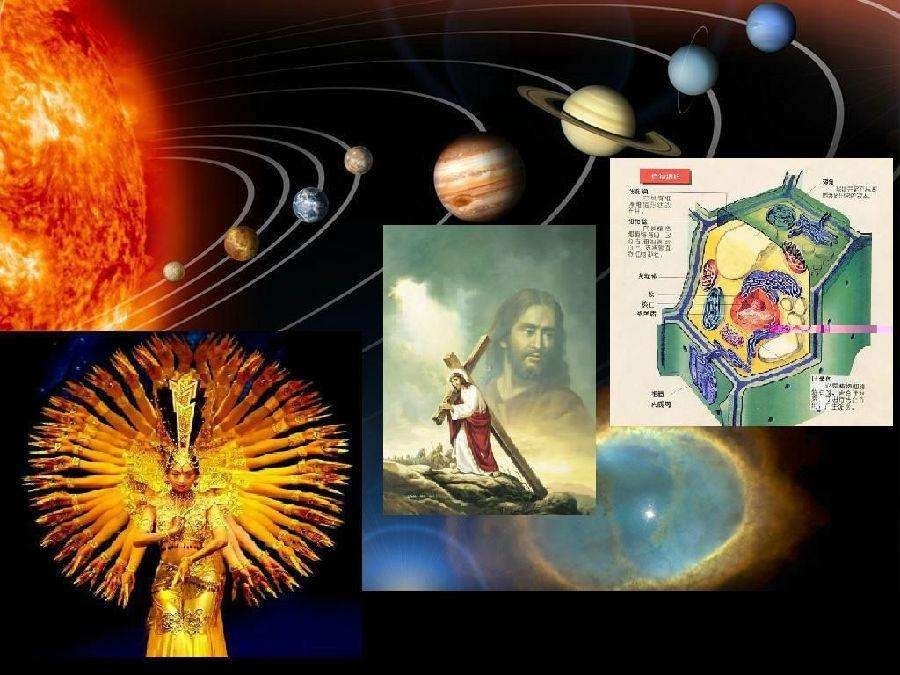

2017-05-07-complex system and mind

## 复杂性及涌现

### 现代经验科学的根基 ——「还原论」

自从人类成为智能生物，产生意识后，便与自然分离，眼前面对的是一个复杂多变的世界。这迫使人们为了生存，必须具有「消除不确定性」的能力。

这方面最早的尝试是巫术和宗教。巫术和宗教在消除人类群体内部不确定上是非常成功的，能够藉由对自然、神灵的共同认同将部落成员组织成一个整体，构建自己的文化乃至文明。但是在另一方面，即**消除外界不确定性**上，却是喜忧参半：巫术指引成功的概率最高也就是一半，信仰的「神灵」也不会总是指引它的子民。

    所以，人们迫切需要自己掌握世界的规律来决定自己的命运。这些被掌握的规律，即是知识。
    
    
|  | 巫术/宗教 | 哲学 | 科学 |
| --- | --- | --- | --- |
| 对象 | 人格自然/超验对象 | 永恒、无限、理想对象| 具体、有限、现实存在|
| 方法 | 交感/信仰 | 理性 | 理性 & 实证 |

    

    然而要掌握知识，首先要确信世界的**有序性**的一面，否则根本就不会有这方面的努力。在人类进入文明史后，对这个问题的不同回答就造就了不同文明传统：其中一种典型的是印度文明，认为世界的本质是「无常」和「苦」的，对探究现象世界没有兴趣，因而发展出了异常丰富的精神修炼和宗教传统；（或者如中国传统认为那张，道是不可言说的，世界万物是一个整体）相反另一种的典型则是古希腊，他们认为世界的命运是定数，是可知的、有规律的，现象世界在本质层面是由简洁的理念完美世界衍生而来的。
    
- 毕达哥拉斯：万物皆数
- 逻各斯主义：世界是一团按照一定比例充分燃烧的活火
- 柏拉图哲学：世界是完美的理念的影子
    

    总之，地处诸多文明交汇的古希腊，不仅成为了人类最早理性文明的中心，并且结合交流产生经验传统，为科学诞生奠定了基石。
    

综上所述，科学正是基于一组这样的假设：

   - **决定论**：存在一个外在独立的世界，它遵循确定性规律。
   - **可知论**：人们可以通过对世界及存在物进行思辨和观察掌握这些规律。
   - **还原论**：世界及世界的存在的各种现象，都可以通过研究恰当分割所得到的部分，进而得到整体本身的性质和规律。

**这也就是线性思维的体现：整体 = 部分之和**

    简而言之，这组假设威力巨大，是科学何以产生的根本原因。整个西方理性文明，或者说整个现代人类文明都是以此建立起来的。而没有科学，就不可能有蒸汽机和工业革命、电的运用和电力革命，和如今方兴未艾的信息革命和智能革命。
    

    然而同时，随着现代科学的不断深化和发展，这组假设也越来越遭到质疑，并被重新认识：其中第一，第二假设被20世纪初的相对论和量子力学打破了，人们认识到并不存在外部绝对时空，并且主体的观测和行为会影响到世界本身；而第三个假设，即还原论也被20世纪70年代所发展的非线性科学与复杂性科学所挑战。

- 相对论：
- 量子力学：
- 复杂性科学：
    

### 复杂性的诞生——非线性思维

在复杂系统科学诞生之前，人们已经习惯了这样的世界观：即世界由自然界／生物／心智／社会组成，但归根结底，所有的社会组织都可以还原为个体，个体的精神和意识都可以还原为生物，而生物的一切又都可以还原为化学和物理，物理则是由不随着人们主观意志转移的某种基质组成：在古希腊是想象中的原子，现在则是基本粒子，如在标准模型中的轻子、夸克和规范子。
    

可以说，基于还原论的经典物理学和电磁学是如此成功，成为了科学毫无争议的代名词，其它学科诸如化学、生物学、心理学、社会学等纷纷效仿，并且由此影响到整个人类文化。世界不再是神秘可知，而是可以被还原为一系列的逻辑序列。宗教衰退，精神的崇高也不再，无神论兴起，人文主义跌到后现代，强科学主义几乎要统一一切。
    

但是，正如前所言，「复杂性」概念的诞生，对以上观念产生了极大冲击，和对科学原有假设的再认识，并由此开启了一个新的研究范式，即超越原有还原论和整体论的「复杂性范式」。
    
    >要想认识复杂，先要认识复杂
    
    「复杂性」这个概念的产生。从背景来说，源自东方观念，即能认识到世界整体，不可分割的一面。但是作为科学而言，依然是从经验现象出发产生的。
    
    我们先看以下几个属于复杂系统的现象。

